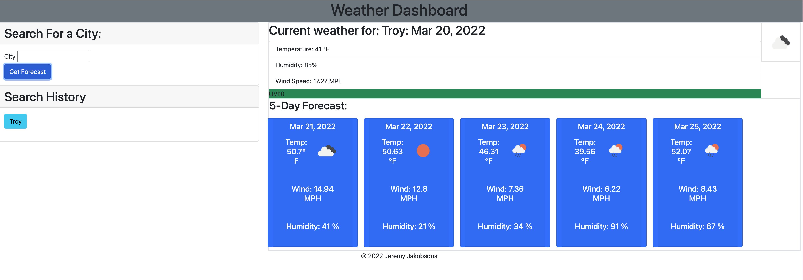

# weatherDashboard
This website is a 5 day weather dashboard 

## Built With 
This page was built using: 
* HTML
* CSS 
* Java Script 
* Third part API: Open Weather 

## Description/Summary 
This website is designed for you to input a city, it will find the first matching city name, and then display the Current conditions, and a 5 day weather forecast. 
The UVI index should change colors the higher the index goes, follow the EPA guidelines.

## Install Instructions 
There is nothing special you need to do to launch/install this site. 
Simply copy the repo and you are all set! 

## Screenshot 

## Link to page 
https://jjakobsons87.github.io/weatherDashboard/